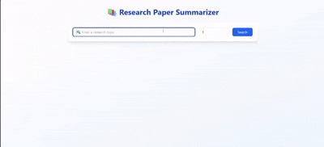

# 🧠 Research Paper Summarizer

## 📌 Overview
A full-stack web application that allows users to **browse topics**, **view research papers**, and **generate AI-powered summaries** using state-of-the-art NLP models (LED, T5, BART).

## 🚀 Features
- Topic-based paper exploration  
- Abstractive + Extractive summarization  
- Ranking algorithm for best summaries  
- Interactive frontend (React + Tailwind + shadcn)  
- Flask backend with model integration  

## 🛠️ Tech Stack
- **Frontend:** React, Tailwind CSS, shadcn UI  
- **Backend:** Flask (Python)  
- **NLP Models:** Hugging Face Transformers (LED, BART)  

## ✅ Todo
- Add user authentication  
- Save and export summaries  
- Multi-language support  
- Evaluation metrics (ROUGE, BLEU) dashboard  

## 🙌 Acknowledgements
Inspired by modern research paper analysis tools & open-source NLP frameworks.  
